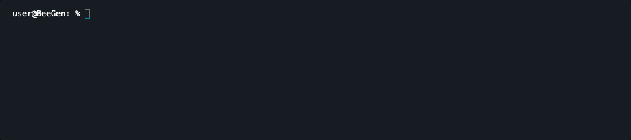
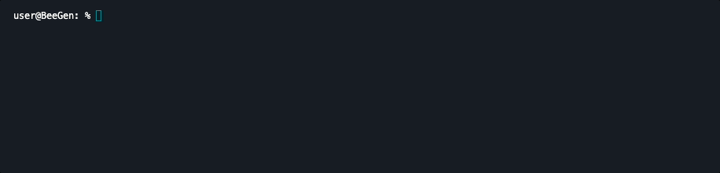
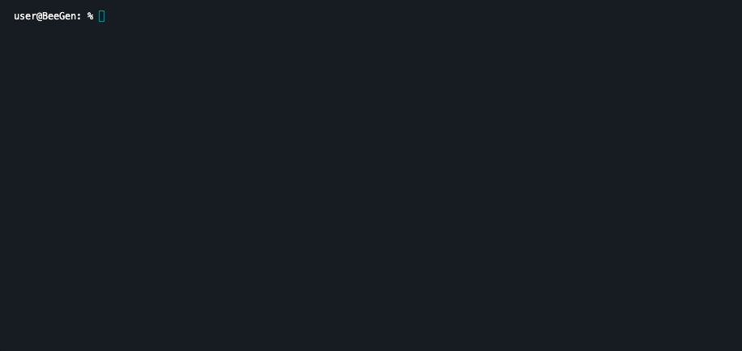
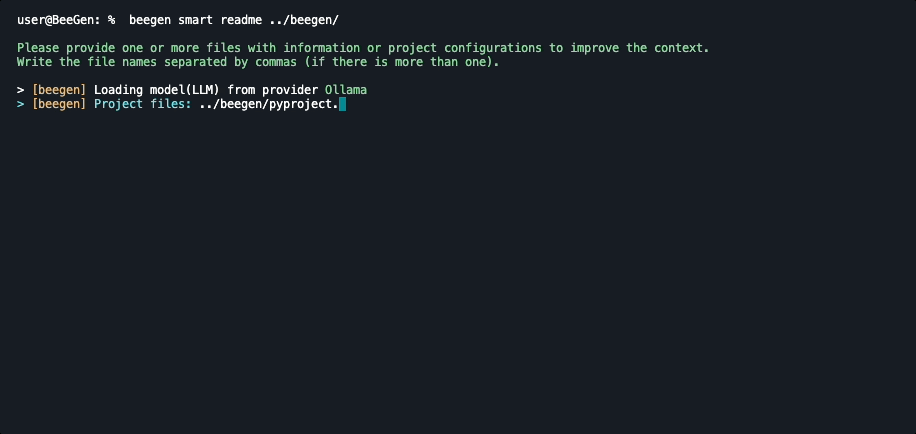
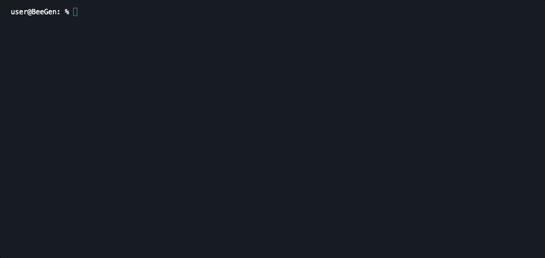

<p align="center">  
    
</p>
<p align="center">
    <em>BeeGen is an intelligent command-line tool designed to assist developers with everyday tasks, leveraging the power of generative AI.</em>
</p>
<p align="center">    
    <a href="https://pypi.org/project/beegen/"></a>
    <a href="https://pypi.org/project/beegen/"></a>
    <a href="https://github.com/psf/black"></a>
    <a href="https://pycqa.github.io/isort/"></a>
    <a href="https://github.com/PyCQA/bandit"></a>    
</p>

## BeeGen

With Beegen, you can streamline your development process, improve code quality, and automate various aspects of project creation and management.

## Features

- **Mock APIs:** Quickly create and run mock API servers.
- **Sensitive Data Anonymization:** Use generative AI to mask identifiable information and ensure privacy.
- **Vector Store Generation:** Create a local vector store using FAISS for projects that require semantic search.
- **README Generator:** Automatically generate a detailed README file for your projects.
- **Translation:** Quickly translate text between different languages.
- **Code Snippets:** Add, list, remove, and use code snippets directly from the command line.
- **AI Chat Interface:** Interact with language models in a terminal-based chat.

## Installation

You can install BeeGen in three ways:

[PyPI](https://pypi.org/project/beegen/)

```bash
pip install beegen
```

Directly from the repository using [poetry](https://python-poetry.org/)

```bash
poetry install
```

Using pipx (recommended):

```bash
pipx install beegen
```

Why `pipx`?

`pipx` installs BeeGen in an isolated environment, avoiding conflicts with other Python packages on your system. This is ideal for command-line tools.

## Usage

Here are a few examples of how you can use BeeGen for daily tasks:

### Configure

Configure the LLM and access keys for usage.

```bash
beegen configure
```



Supported models include:
- **OpenAI:** Requires a valid OpenAI API key.
- **Ollama:** You need to install the Ollama CLI tool locally and download the desired model for it to work. More details can be found at [Ollama's official site](https://ollama.com/).
- **Gemini:** You can use the free model with a personal key. For more information, visit [Gemini's official site](https://aistudio.google.com/).

### Create a Mock API

Generate a configuration file for a mock API:

```bash
beegen mock create
```

**Mockefile (template)**

```yaml
authentication:
  key: 20s7ILRwS9eMU8sXQ1sT9WaxFQTJwK5usCz3P_Ium6E
  name: X-API-Key
  type: api_key
description: BeeGen mockfile API example
endpoints:
- access: public
  method: GET
  path: /users
  response:
    body:
    - email: john.doe@example.com
      id: 1
      name: John Doe
    - email: jane.doe@example.com
      id: 2
      name: Jane Doe
    status: 200
- access: protected
  method: POST
  path: /user
  request:
  - description: The user ID
    name: id
    type: int
  - description: The user name
    name: name
    type: str
  - description: The user email
    name: email
```

Run the mock API server:

```bash
beegen mock run
```

### Anonymize Sensitive Data

Use the following command to anonymize sensitive data with generative AI to ensure privacy by masking identifiable information:

```bash
beegen smart anonymize-data "<your text>"
```



Anonymize sensitive data in files:

```bash
beegen smart anonymize-data --file data.txt
```

### Create a Vector Store

Build a local vector store from specific files or directories:

```bash
beegen smart create-vectorstore <your path>
```



### Generate a README

Automatically generate a detailed README file for your project:

```bash
beegen smart readme <your path>
```



### Generate a Regex

Generate a regular expression based on the provided value:

```bash
beegen smart regex "email@email.com" --language python
```



### Full List of Commands

To view the complete list of available commands, run:

```bash
beegen list
```

## Contributing

Contributions to BeeGen are welcome! If you find a bug, have a feature request, or want to improve the code, please submit a pull request.

## License

BeeGen is licensed under the MIT License. See the [LICENSE](/LICENSE) file for more information.