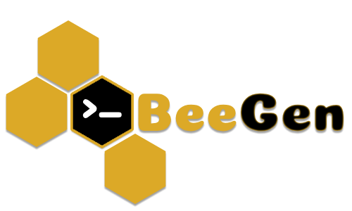

  
    

    <em>BeeGen is an intelligent command-line tool designed to assist developers with everyday tasks, leveraging the power of generative AI.</em>

    
    
    
    

## BeeGen

With Beegen, you can streamline your development process, improve code quality, and automate various aspects of project creation and management.